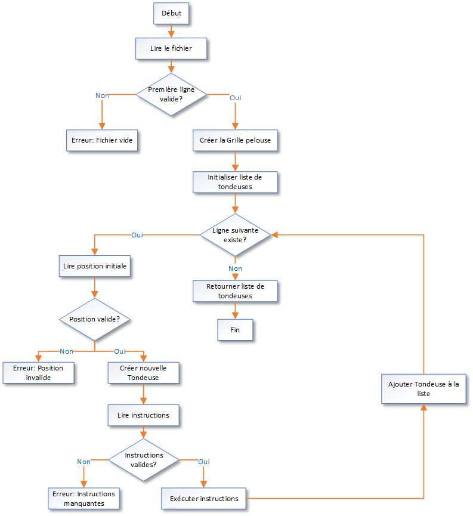
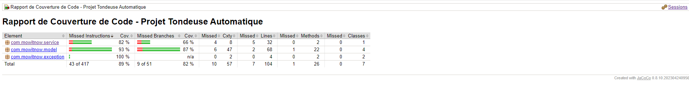

# Projet de Tondeuses Automatiques

## Description
Ce projet implémente un système de contrôle pour des tondeuses automatiques. Il permet de simuler le mouvement de tondeuses sur une pelouse rectangulaire en suivant une série d'instructions.

## Table des matières
1. [Prérequis](#prérequis)
2. [Installation](#installation)
3. [Utilisation](#utilisation)
4. [Résultats attendus](#résultats-attendus)
5. [Diagramme de flux](#diagramme-de-flux)
6. [Couverture de code](#couverture-de-code)

## Prérequis
- Java JDK 17 ou supérieur
- Maven (pour la compilation et la gestion des dépendances)

## Installation

### 1. Cloner le projet
```bash
git clone https://github.com/meher12/tondeuse-automatique.git
cd tondeuse-automatique
```

### 2. Construire le projet avec Maven
À la racine du projet, ouvrez un terminal et exécutez la commande suivante pour compiler le code, exécuter les tests et créer un fichier JAR exécutable dans le dossier "target/" :
```bash
mvn clean package
```

## 3. Utilisation

### Exécuter le programme
Pour lancer l'exécution, utilisez la commande suivante :
```bash
java -jar target/tondeuse-automatique-1.0-SNAPSHOT.jar src/main/resources/instructions.txt
```

## Résultats attendus
Après l'exécution du programme, vous devriez voir une sortie formatée comme suit :
```
Résultats de la simulation des tondeuses :
========================================
Tondeuse 1 :
  Position finale : (1, 3)
  Orientation    : N
----------------------------------------
Tondeuse 2 :
  Position finale : (5, 1)
  Orientation    : E
----------------------------------------
Total des tondeuses traitées : 2
```

## Diagramme de flux
Le diagramme ci-dessous illustre le processus de lecture des instructions à partir du fichier :



## Couverture de code
Voici le rapport de couverture de code pour le projet Tondeuse Automatique :



---

Merci !! 😊
